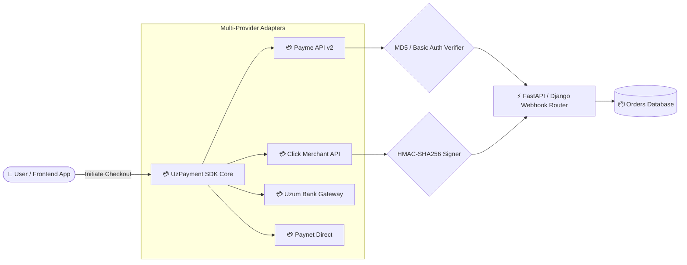

# 💳 UzPayment SDK — Universal Payment Gateway for Uzbekistan

<div align="center">

[](https://www.npmjs.com/package/@javohirbek3302/uzpayment-sdk)
[](https://pypi.org/project/uzpayment/)
[](https://www.python.org/)
[](LICENSE)
[](tests/)
[](examples/)

<p align="center">
  <b>Production-ready, type-safe, and asynchronous Multi-Provider Payment Gateway SDK for Uzbekistan (Click, Payme, Uzum Bank, Paynet).</b>
</p>

</div>

---

## 🏛️ Architecture Overview



---

## 🌟 Nega aynan UzPayment SDK? (Key Highlights)

- ⚡ **3 qatorda to'lovlarni ulash** (FastAPI, Django, Flask uchun plug-and-play adapterlar).
- 🔒 **100% Xavfsizlik:** MD5, HMAC-SHA256 va Basic Auth imzo tekshiruvlari avtomatik ishlaydi.
- 🔗 **Tezkor Checkout Link & QR:** Click, Payme va Uzum uchun to'lov havolalarini 1 ta funksiya bilan yaratish.
- 📦 **PyPI & NPM Standarti:** `pip install uzpayment` orqali to'g'ridan-to'g'ri o'rnatish.
- 🧪 **Lokal Mock Server:** Real hisob raqamsiz ham webhooks va to'lovlarni lokal mashinangizda testlash.

---

## 📦 O'rnatish (Installation)

```bash
pip install uzpayment
```

Yoki framework adapterlari bilan:
```bash
pip install "uzpayment[fastapi]" # FastAPI uchun
pip install "uzpayment[django]"  # Django uchun
```

---

## 🚀 Quickstart: FastAPI ga 3 Qatorda Ulash!

```python
from fastapi import FastAPI
from uzpayment import UzPayment, PaymeConfig, ClickConfig, AccountVerificationResult, PaymentProviderType
from uzpayment.integrations.fastapi import create_payment_router

app = FastAPI()

gateway = UzPayment(
    payme=PaymeConfig(merchant_id="YOUR_PAYME_ID", secret_key="YOUR_PAYME_SECRET"),
    click=ClickConfig(service_id="YOUR_SERVICE_ID", merchant_id="YOUR_MERCHANT_ID", secret_key="YOUR_CLICK_SECRET")
)

def verify_order(order_id: str, amount: int, provider: PaymentProviderType) -> AccountVerificationResult:
    return AccountVerificationResult(is_valid=True, order_id=order_id)

def on_payment_success(trans_id: str):
    print(f"✅ To'lov muvaffaqiyatli qabul qilindi: {trans_id}")
    return {"status": "SUCCESS"}

app.include_router(create_payment_router(
    gateway=gateway,
    on_verify=verify_order,
    on_create=lambda **kw: {"transaction_id": kw.get("trans_id"), "state": 1},
    on_success=on_payment_success
))
```

---

## 🧪 Run Automated Tests

```bash
pytest -v tests/
```

---

## 👨‍💻 Muallif & Dasturchi
- **Muallif:** [Javohirbek Asqarov (Jasper)](https://github.com/salomh46-rgb)
- **Portfolio:** [bestportfoliyo-o4z2.vercel.app](https://bestportfoliyo-o4z2.vercel.app/)
- **Litsenziya:** MIT License
